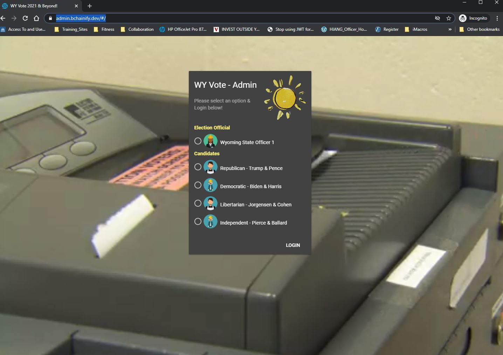
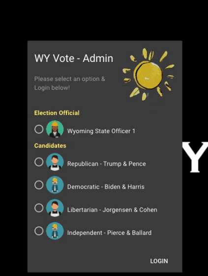
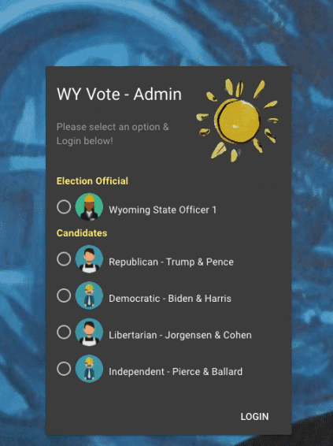

# WYVote2020 Admin Application

# WYVote2020 & beyond!
WyoHackathon 2020 block chain project

## Whitepaper
Our project whitepaper can be found here:
[click here](https://github.com/bchainify/wyvote2020/blob/main/mktg/Whitepaper-WyVote2021%20%26%20Beyond.pdf)

## Technology-Stack:
* Front-End Development: HTML, CSS, VueJS, Vuetify, ReactJS, 
* Blockchain Development:  SimbaChain, 
* Smart Contract Development: Remix

## What it Does:
* Election officials create a smart contract for a tokenized election ballot.
* The Election Official (smart contract owner) adds candidates to the election ballot
* The Election Official (smart contract owner) adds authorized voters so they can vote on the election ballot
* Voters register with a wallet so that they can cast a secure and private vote
* Voters then cast their vote for a selected candidate
* Voters get a confirmed transaction ID that is a unique hash on the blockchain, confirming their vote was cast
* Voters can also sign up for SMS or email notification to confirm their vote
* Election officials can view vote tally by a candidate or by overall ballot
* Election officials can end the election ballot, locking it from further transactions

### Demo App
See [Admin Portal](https://admin.bchainify.dev).

